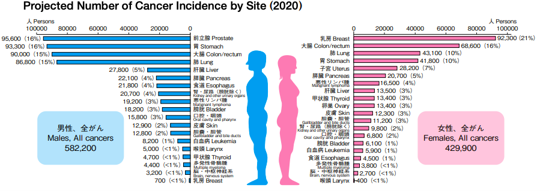

# Cancer-survivorship-smartcard
Demo for cancer survivorship care to improve life of quality for cancer survivors 

# Numbers 

## US
More than 16.9 million Americans (8.1 million males and 8.8 million females) with a history of cancer were alive on January 1, 2019;

## US Survival Rate
In 2019, 67% of survivors (10.3 million) have survived 5 years or more after diagnosis;

## Japan

## Japan Survival Rate

# Challenges

## Disparities in accessing healthcare for marginalized communities

### difinition of disarities for racial minority group 
https://www.healthypeople.gov/2020/about/foundation-health-measures/Disparities

# What is Cancer Survivorship Care ?
s
# What is Cancer Survivorship Care 
## workflow 

## Digitalied workflow

# Digitalization of Health Record / Telemedicine 

# Prerequisites
### ReactJs /Typescript
### Or 
### Docker 

# Wrap-up
